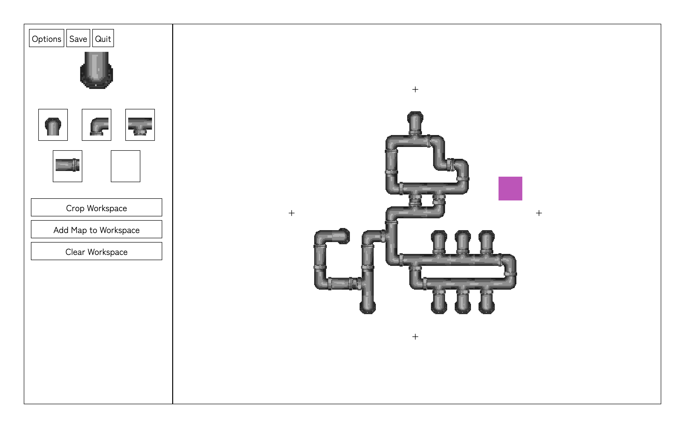
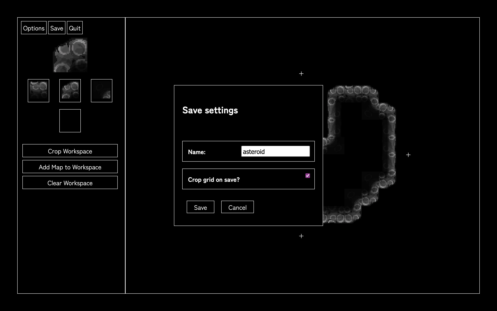

# Tile-Editor

  

  

  

  

A dev tool for laying out tile-based patterns, maps, etc.

Renders a two-dimensional, coordinate-indexed Grid in which tiles can be placed, and provides functionality for selecting, moving, and performing actions on (fill, delete, copy, paste, etc.) subsets of those tiles.

Originally created to aid the development of my <a href="https://github.com/nymphofthevales/Keeper-of-the-Labyrinth">Keeper of the Labyrinth</a> project, since that project includes a save file viewer in the form of a branching map.

Capable of save/load with a readable JSON format. Easily add user-defined tilesets as folders of images with a specifications file. Expand workspace indefinitely, and crop down to useful area at any time. Add saved maps to the current workspace to combine maps.

Currently in development. Final build coming soon.

